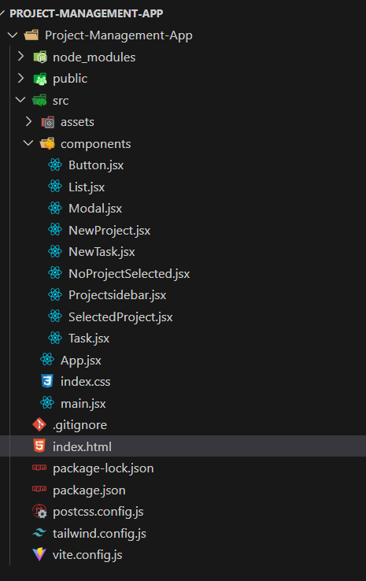
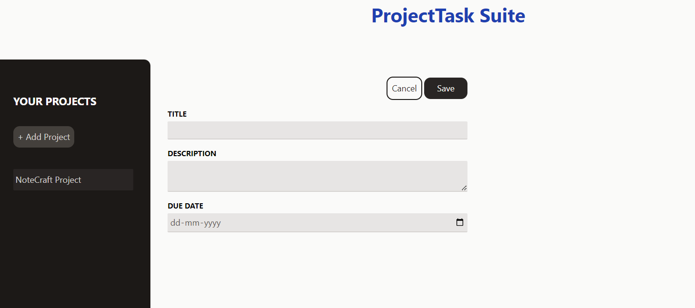
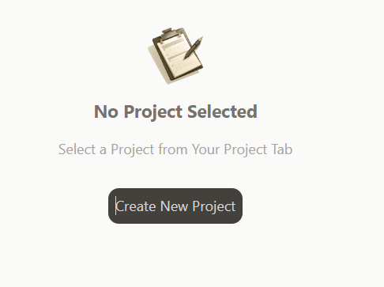
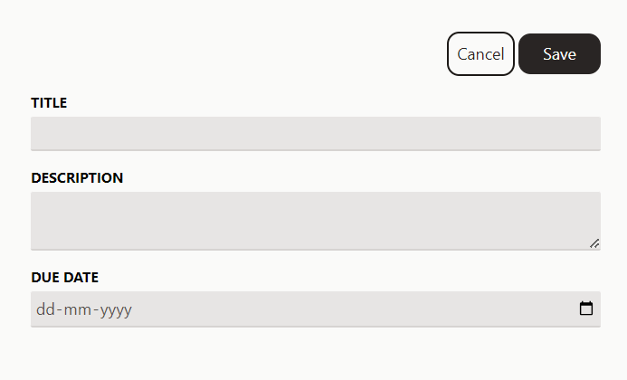

# **ProjectTask Suite**

## **Description**
ProjectTask Suite is a project management application built using React.js. It allows users to manage their projects efficiently by creating, viewing, editing, and deleting projects. Within each project, users can add multiple tasks, making it easier to track progress and stay organized.

## **Features**
- **Create Projects**: Start new projects effortlessly.
- **View Projects**: Easily browse through your existing projects.
- **Edit Projects**: Make changes to your project details anytime.
- **Delete Projects**: Remove projects that are no longer needed.
- **Task Management**: Manage multiple tasks within each project.

## **Screenshots**

### **Project Structure**


### **Main Project Interface**


### **No Project Selected**


### **New Project Section**


## **Getting Started**

### **Prerequisites**
Ensure you have Node.js installed on your system.

### **Installation**

1. **Clone the repository:**
   ```bash
   git clone https://github.com/Abhirup193/ProjectTask-Suite.git
2. **Navigate to the project directory:**
   ```bash
   cd ProjectTask-Suite
3. **Install dependencies:**
   ```bash
   npm install
4. **Run the development server:**
   ```bash
   npm run dev
## **Usage**
- Open your browser and go to http://localhost:3000 to start using ProjectTask Suite.
